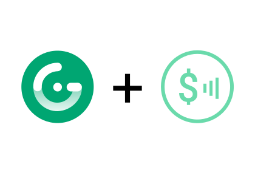

# gridsome-plugin-monetization

[![npm version][npm-version-src]][npm-version-href]
[![npm downloads][npm-downloads-src]][npm-downloads-href]
[![Github Actions CI][github-actions-ci-src]][github-actions-ci-href]
[![Codecov][codecov-src]][codecov-href]
[![License][license-src]][license-href]



> Web monetization plugin for Gridsome.

[📖 **Release Notes**](./CHANGELOG.md)

## Setup

1. Add `gridsome-plugin-monetization` dependency to your project

```bash
yarn add gridsome-plugin-monetization # or npm install gridsome-plugin-monetization
```

2. Add `gridsome-plugin-monetization` to the `plugins` section of `gridsome.config.js`

```js
{
  plugins: [
    {
      use: "gridsome-plugin-monetization",
      options: {
        paymentPointer: "$wallet.example.com/alice", // your payment pointer
        global: true, // add monetization to every page; default: true
      },
    },
  ],
}
```

## Usage

For `gridsome-plugin-monetization` to work properly, you must [specify your payment pointer](https://paymentpointers.org/) (`paymentPointer`) in the gridsome plugin options as shown above.

> **NOTE:** As of now, any of the following methods are unable to be accessed at build time through component `data` or `template`s due to SSR constraints.

### Methods

#### `$monetization.enable()`

Enables web monetization for the current page if not already enabled.

_Returns: HTMLElement | false_

#### `$monetization.disable()`

Disables web monetization for the current page if not already disabled.

_Returns: undefined | false_

#### `$monetization.getObject()`

Gets the document's monetization DOM object if monetization is enabled.

_Returns: HTMLElement | false_

#### `$monetization.isSupported()`

Checks if the browser has monetization capability within the document.

_Returns: true | false_

#### `$monetization.isEnabled()`

Checks if the monetization is currently enabled within the document.

_Returns: true | false_

#### `$monetization.isDisabled()`

Checks if the monetization is currently disabled within the document.

_Returns: true | false_

#### `$monetization.isStarted()`

Checks if the browser is currently sending payments.

_Returns: true | false_

#### `$monetization.isPending()`

Checks if the browser is currently preparing to send payments.

_Returns: true | false_

#### `$monetization.isStopped()`

Checks if the browser is currently not sending payments.

_Returns: true | false_

#### `$monetization.getState()`

Gets the current state of the browser's monetization event if monetization is enabled.

_Returns: ("started" || "stopped" || "pending") | false_

#### `$monetization.getEventStateString()`

Converts a monetization event to its corresponding state string.

_Returns: ("started" || "stopped" || "pending") | false_

### Event Attachments

> The specification for the `event` objects returned for each handler are specified on the [Web Monetization JavaScript API page](https://webmonetization.org/docs/api).

#### `$monetization.onStart(function handler(event))`

Attaches a listener for the `started` state on the monetization object using the specified handler.

_Returns: undefined | false_

#### `$monetization.onPending(function handler(event))`

Attaches a listener for the `pending` state on the monetization object using the specified handler.

_Returns: undefined | false_

#### `$monetization.onStop(function handler(event))`

Attaches a listener for the `stopped` state on the monetization object using the specified handler.

_Returns: undefined | false_

#### `$monetization.onProgressChange(function handler(event))`

Attaches a listener for when the current amount of progress in sending funds changes on the monetization object using the specified handler.

_Returns: undefined | false_

#### `$monetization.onStateChange(function handler(event))`

Attaches the `onStart`, `onPending`, and `onStop` listeners to the handler.

_Returns: undefined | false_

### Example

This example can also be found by launching the demo project in the `demo/` folder (see the **Development** section below).

```vue
<template>
  <Layout>
    <button @click="toggle">Toggle Monetization</button>
    <h2>Current state: {{ state }}</h2>
  </Layout>
</template>

<script>
export default {
  metaInfo: {
    title: "Web Monetization",
  },
  data() {
    return {
      state: "Waiting for monetization to load...",
    }
  },
  methods: {
    toggle() {
      this.$monetization.isEnabled()
        ? this.$monetization.disable()
        : this.$monetization.enable()
    },
  },
  mounted() {
    this.state = this.$monetization.getState()
    this.$monetization.onStateChange(
      (event) => (this.state = this.$monetization.getEventStateString(event))
    )
  },
}
</script>
```

## Development

1. Clone this repository
2. Install dependencies using `yarn install` or `npm install`
3. `yarn link` or `npm link` in the projects directory
4. `cd demo/`
5. `yarn link gridsome-plugin-monetization` or `npm link gridsome-plugin-monetization` in the `demo/` directory
6. Start the development server with `yarn dev` or `npm run dev`

## License

[MIT License](./LICENSE)

Copyright (c) sergix <hello@sergix.dev>

<!-- Badges -->

[npm-version-src]: https://img.shields.io/npm/v/gridsome-plugin-monetization/latest.svg
[npm-version-href]: https://npmjs.com/package/gridsome-plugin-monetization
[npm-downloads-src]: https://img.shields.io/npm/dt/gridsome-plugin-monetization.svg
[npm-downloads-href]: https://npmjs.com/package/gridsome-plugin-monetization
[github-actions-ci-src]: https://github.com//workflows/ci/badge.svg
[github-actions-ci-href]: https://github.com//actions?query=workflow%3Aci
[codecov-src]: https://img.shields.io/codecov/c/github/.svg
[codecov-href]: https://codecov.io/gh/
[license-src]: https://img.shields.io/npm/l/gridsome-plugin-monetization.svg
[license-href]: https://npmjs.com/package/gridsome-plugin-monetization
